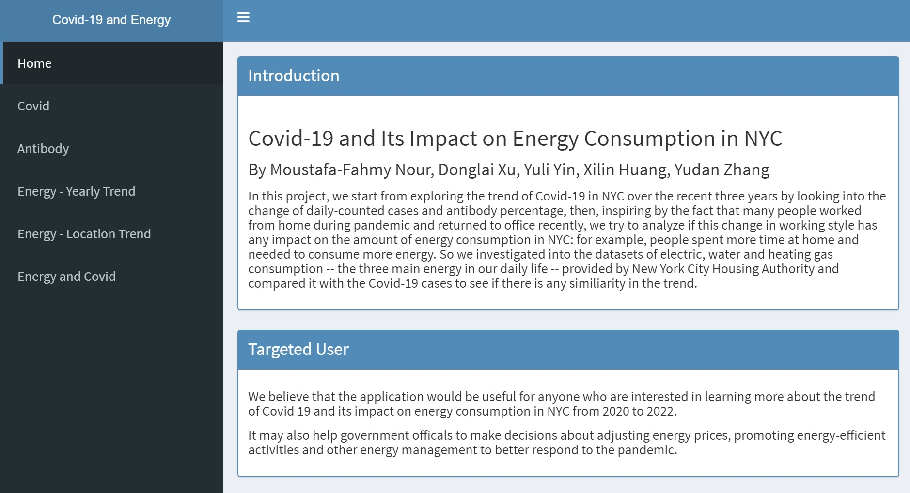

# Project 2: Shiny App Development

### [Project Description](doc/project2_desc.md)



## Project Title Covid 19 and Its Impact on Energy Consumption in NYC
Term: Fall 2022

+ Team 12
+ **Team members**: 
	+ Nour Moustafa-Fahmy
	+ Donglai Xu
	+ Yuli Yin
	+ Xilin Huang
	+ Sherry (Yudan) Zhang

+ **Project summary**: In this project, we analyzed energy consumption and covid and antibody trends before, during and after the pandemic to determine if energy consumption has changed as people adjusted to the quarantine. We believe that the application would be useful for anyone who are interested in learning more about the trend of Covid 19 and its impact on energy consumption in NYC from 2020 to 2022. It may also help government officals to make decisions about adjusting energy prices, promoting energy-efficient activities and other energy management to better respond to the pandemic.

+ **Contribution statement**: ([default](doc/a_note_on_contributions.md)) 
	+ Nour Moustafa-Fahmy: Responsible for antibody section; heatmap of positive test percentages, yearly changes, and data table of poverty levels vs antibody rates (the 'antibody' tab). Was also responsible for extending Yuli's project framework and merging everyone's code into final project, and debugging therein.
	+ Donglai Xu: Coding the Covid-19 statistics part of shiny app. Discussing the topic and writing the conclusion with the other group members.
	+ Yuli Yin: Led the discussion of main topic and built the framework of the project. Took responsibility for the energy consumption part with Xilin by investigating into the energy datasets, came up with the line plot idea, and drew some conclusions. Wrote the code and description for Tab1- Introduction and Tab 5 – Energy Yearly Trend.
	+ Xilin Huang: Find the possible dataset from housing agency. Come up with the idea of plotting electricity consumption on map and give possible output graphs from that dataset. By adding Yuli’s idea, adding three types of energy consumption (electricity,water and heating gas) map to our project. Decide the specific date range we use in our projectof energy consumption part. Response for the code of energyconsumption map of the 4th tab. Contribute the conclusion part with all the other group members.
	+ Sherry (Yudan) Zhang: Code the comparison between 3 types of energy consumption &amp; total Covid cases counted by nyc’s 5 boroughs part in Shiny app. Responsible for the presentation. Organized the conclusion from each part of the Shiny app &amp; contribution in file. Provide the idea of the project outline that connects the energy consumption with Covid.

Following [suggestions](http://nicercode.github.io/blog/2013-04-05-projects/) by [RICH FITZJOHN](http://nicercode.github.io/about/#Team) (@richfitz). This folder is orgarnized as follows.

```
proj/
├── app/
├── lib/
├── data/
├── doc/
└── output/
```

Please see each subfolder for a README file.

